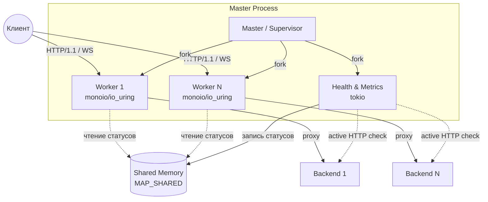

# rproxy — HTTP/1.1 reverse proxy на Rust + io_uring

Reverse proxy для HTTP/1.1 и WebSocket: `monoio` (io_uring), архитектура **prefork /
thread-per-core**, zero-alloc горячий путь, состояние бэкендов и метрики — в shared memory
(`MAP_SHARED`) без локов. Маршрутизация по Host и пути, 7 алгоритмов балансировки, фильтрация
запросов (метод / заголовки / query / cookie / form-body / JWT / IP / rate-limit), L7-кэш ответов,
активные health-check'и, Prometheus-метрики.

## Производительность — измеренное

Единственный источник цифр — [`bench/BENCHMARK_RESULTS.md`](bench/BENCHMARK_RESULTS.md)
(2026-06-27, bare-metal, медиана из 3 прогонов после прогрева, разброс <2 %):

| Сценарий | req/s | avg lat | vs nginx |
|---|---:|---:|---:|
| Потолок стенда (бэкенд без прокси) | 362 163 | 292 µs | — |
| nginx reverse proxy | 153 484 | 662 µs | 1.00× |
| **rproxy** | **189 810** | **557 µs** | **1.24×** |

Условия: i5-12450H (12 логических ядер), `wrk -t4 -c100 -d10s` keep-alive на ядрах 4–7, бэкенд
nginx с ответом «200 OK» (2 байта) на ядрах 0–1, прокси на ядрах 2–3, по 2 воркера у rproxy и
nginx (равные ядра).

**Сравнение трёх прокси на одном стенде (измерено 2026-08-16,
`bench/haproxy_baseline.sh`, nginx-бэкенд, `wrk -t4 -c100 -d10s`, медиана из 3;
nginx-прокси с keep-alive к бэкенду — без него nginx открывает TCP на каждый
запрос и цифры вводят в заблуждение):**

| Прокси | req/s | avg lat | vs потолок | vs nginx |
|---|---:|---:|---:|---:|
| Потолок стенда (nginx без прокси) | 632 175 | 157 µs | 1.00× | — |
| **rproxy** | **323 035** | **352 µs** | 0.51× | **1.15×** |
| nginx reverse proxy | 282 032 | 400 µs | 0.45× | 1.00× |
| haproxy 2.8.5 (vendored build) | 266 603 | 395 µs | 0.42× | 0.95× |

rproxy **обгоняет haproxy на ~21 %** и **nginx-reverse-proxy на ~15 %** на этом
стенде (nginx и haproxy здесь почти равны). TLS (self-signed,
`bench/tls_bench.sh`): потолок 629 459 req/s → **rproxy TLS 134 168 req/s**
(~21 % потолка — цена терминации TLS).

Границы применимости этих чисел: маленький keep-alive ответ (случай, где склейка головы и тела
даёт больше всего), один бэкенд на той же машине, без TLS. На больших телах, без keep-alive и под
TLS расклад может быть другим. rproxy = 52 % потолка стенда (HTTP), то есть узкое место — прокси, а
не стенд.

**HAProxy на текущем стенде не измерялся.** Конфиг для сравнения есть в `bench/haproxy.cfg`, но
bare-metal базлайна для него нет, поэтому сравнение с HAProxy не заявляется.

---

## Оглавление

1. [Ключевые фичи](#ключевые-фичи)
2. [Архитектура](#архитектура)
3. [Сборка и запуск](#сборка-и-запуск)
4. [Конфигурация](#конфигурация)
   - [Как читается файл](#как-читается-файл)
   - [Глобальные параметры](#глобальные-параметры)
   - [Домены](#домены)
   - [Маршруты и фильтры](#маршруты-и-фильтры)
   - [`validate` — валидация с кастомным ответом](#validate--валидация-с-кастомным-ответом)
   - [Бэкенды](#бэкенды)
   - [Балансировка](#балансировка)
   - [Health-check'и](#health-checki)
   - [Кэш ответов](#кэш-ответов)
   - [TLS и SNI](#tls-и-sni)
   - [Наследование параметров](#наследование-параметров)
5. [Примеры конфигураций](#примеры-конфигураций)
6. [Безопасность и лимиты](#безопасность-и-лимиты)
7. [Коды ответов прокси](#коды-ответов-прокси)
8. [Метрики](#метрики)
9. [Production-чеклист](#production-чеклист)
10. [Что НЕ реализовано](#что-не-реализовано)
11. [Документы репозитория](#документы-репозитория)

---

## Ключевые фичи

- **io_uring через `monoio`** — весь сетевой I/O воркеров.
- **Zero-lock / zero-alloc горячий путь** — переиспользуемые буферы (`PooledBuf`), состояние в
  `thread_local!`, без мьютексов. Аллокации остаются только на редких путях (например,
  неканоничный request-target — см. `normalize_path`).
- **Shared memory IPC (`MAP_SHARED`)** — liveness бэкендов и счётчики метрик видны всем процессам
  без блокировок; health-check'и и опрос `/metrics` не мешают трафику.
- **Rendezvous hashing (HRW)** для `iphash`/`urlhash` — при выпадении узла переезжает только его
  доля ключей.
- **WebSocket / `Upgrade`** — двунаправленный туннель после `101 Switching Protocols`, включая
  байты, пришедшие до апгрейда.
- **Keep-alive с обеих сторон** — на бэкенды идёт пул соединений (`backend_pool_size`) с прозрачным
  однократным ретраем, если пул отдал закрытое соединение.
- **Защита протокола** — отказ от неоднозначного фрейминга (smuggling), таймауты против Slowloris,
  канонизация пути перед матчингом ACL, QoS-сброс под перегрузкой.

---

## Архитектура



1. **Master** читает конфиг, инициализирует shared memory, создаёт слушающие сокеты, затем
   форкает health/metrics-процесс и N воркеров. Дальше он только ждёт (`waitpid`) и **перезапускает
   упавших** детей — трафик через него не идёт.
2. **Health/metrics-процесс** — отдельный форк со **своим tokio-рантаймом**: активные HTTP-проверки
   бэкендов и HTTP-эндпоинт метрик. Внутри воркеров tokio нет вообще.
3. **Воркеры** — однопоточные `monoio`-процессы: `accept` (балансировка соединений ядром через
   `SO_REUSEPORT`), парсинг HTTP, роутинг, проксирование байтов.

Каждый воркер независим: счётчики `rate_limit`, LRU-кэш и пул соединений к бэкендам — **свои у
каждого воркера** (см. предупреждения ниже).

---

## Сборка и запуск

Требуется Linux с io_uring (ядро 5.6+, рекомендуется 5.11+).

```bash
cargo build --release

# проверить конфиг и выйти (exit 0 — ок, exit 1 — ошибка; удобно для CI)
./target/release/rproxy -t -c /path/to/rproxy.yml

# запустить
./target/release/rproxy -c /path/to/rproxy.yml
```

| Флаг | Значение |
|---|---|
| `-c <path>` | Путь к конфигу. По умолчанию `rproxy.yml` в текущем каталоге. |
| `-t` | Только проверить конфиг (`syntax is ok` / `test is successful`), не слушать порты. Код возврата: `0` — успех, `1` — ошибка загрузки. |

Спец-сборка с поцикловым профилированием (`build_upstream_head`, `build_response_head`,
`jwt_claim_u64`): `cargo test --release --features cycle_profile cycle_profile_report --
--ignored --nocapture` печатает count/min/p50/mean/p99/max в TSC-тактах на функцию плюс сырые
значения последних 1024 вызовов каждой (см. `src/cycles.rs`). Флаг `cycle_profile` по умолчанию
выключен и не попадает в обычную сборку (проверено побайтовым сравнением `.text`/`.data`/`.bss` и
таблицы символов). Тактовые числа — это TSC-тики, не буквальные такты ядра, и метод годится только
для синхронных функций без `.await` внутри — async-функция, которая паузится изнутри, покажет
время ожидания планировщика, а не свою реальную CPU-стоимость.

---

## Конфигурация

### Как читается файл

- Формат — YAML (`serde_yaml`).
- **Подстановка переменных окружения:** `${VAR}` и `$VAR` заменяются значением переменной; если
  переменной нет — пустой строкой. Исключение: `$client_ip` **не** трогается — это рантайм-макрос
  для `set_headers`.
- **Неизвестные ключи молча игнорируются** (serde без `deny_unknown_fields`). Опечатка в имени
  ключа не вызовет ошибку — она просто не применится. Проверяйте важные значения по логу старта
  и `-t`.

### Глобальные параметры

| Ключ | Тип | По умолчанию | Описание |
|---|---|---|---|
| `listen` | список `"ip:port"` | `["0.0.0.0:80"]` | HTTP-сокеты. |
| `tls_listen` | список `"ip:port"` | `[]` | HTTPS-сокеты (нужны `tls_cert`/`tls_key`). |
| `listen_iface` | строка | — | Привязка сокетов к интерфейсу (`SO_BINDTODEVICE`). Неверное имя — падение на старте. |
| `tls_cert` / `tls_key` | путь | — | Сертификат и ключ по умолчанию. |
| `workers` | строка | `"auto"` | Число воркеров; `"auto"` = число доступных ядер. Максимум **256** (больше — обрезается). Нечисловое значение → WARNING + auto. |
| `balance` | строка | `roundrobin` | Алгоритм балансировки по умолчанию (см. [Балансировка](#балансировка)). |
| `default` | список бэкендов | — | Бэкенды, когда ни один домен/маршрут не подошёл. |
| `health` | строка | — | Спека проверок по умолчанию (см. [Health](#health-checki)). |
| `client_timeout` | **секунды** | `60` | Таймаут чтения/записи клиента (защита от Slowloris). |
| `connect` | **секунды** | `5` | Таймаут подключения к бэкенду. |
| `response` | **секунды** | `30` | Максимальная пауза между чтениями ответа бэкенда. |
| `max_body_size` | байты | `2097152` (2 МиБ) | Лимит тела запроса; превышение → `413`. |
| `max_headers_size` | байты | `8192` | Лимит размера заголовков запроса; превышение → `431`. |
| `max_active_requests` | число | `10000` | Жёсткий потолок одновременных запросов **на воркер**; превышение → `503`. Работает всегда, независимо от QoS. |
| `normalize_path` | bool | `true` | Канонизация request-target до маршрутизации (см. ниже). |
| `reject_encoded_slash` | bool | `false` | Отклонять закодированный разделитель в пути (см. ниже). |
| `allow_ip` / `deny_ip` | список CIDR | — | Белый/чёрный список клиентских адресов; наследуется в домены и маршруты. |
| `jwt_secret` | строка | — | Секрет HMAC для проверки `Authorization: Bearer <JWT>`; проверяются подпись, `exp` и `nbf`. Невалидный → `401`. |
| `cache` | блок | — | Кэш ответов (см. [Кэш](#кэш-ответов)). |
| `cache_max_bytes` | байты | `104857600` (100 МиБ) | Бюджет кэша **на воркер** (LRU). Итоговая память ≈ `cache_max_bytes × workers`. |
| `set_headers` | map | — | Заголовки, добавляемые к запросу на бэкенд. Значение поддерживает `$client_ip` и `${ENV}`. |
| `backend_pool_size` | число | `16` | Размер пула keep-alive соединений к бэкенду **на воркер**. `0` — выключить переиспользование. |
| `metrics_listen` | `"ip:port"` | — | Адрес эндпоинта метрик (в отдельном процессе). |
| `metrics_path` | путь | `/metrics` | Путь эндпоинта. |
| `metrics_token` | строка | — | `Authorization: Bearer <token>`; сравнение constant-time. |
| `metrics_basic_auth` | `"user:password"` | — | HTTP Basic; при 401 отдаётся `WWW-Authenticate`. |
| `log_level` | строка | `info` | `none`/`off`, `error`, `warn`, `info`, `debug`, `trace`. Пер-запросный access-лог печатается на `debug` (на `info` горячий путь не аллоцирует). |
| `cpu_affinity` | `auto`/`on`/`off` | `auto` | Пиннинг воркеров к ядрам. `auto` включает его только если свободных ядер больше, чем воркеров, и нет cgroup-переподписки. |
| `sqpoll` | `auto`/`on`/`off` | `auto` | io_uring SQPOLL. `auto` = **выключено**: на замерах выигрыш не подтвердился, а ядро под поллер тратится. |
| `sqpoll_idle_ms` | число | `1000` | Idle-таймаут SQPOLL-потока, если он включён. |
| `worker_lifetime` | секунды | выкл | Рециклинг воркера по времени жизни (джиттер ±25 %, чтобы не рестартовали синхронно). |
| `worker_max_requests` | число | выкл | Рециклинг воркера по числу обслуженных запросов. |
| `worker_drain` | секунды | `max(response, 30) + 5` | Потолок graceful-слива перед выходом при рециклинге. Во время слива воркер не принимает новые соединения и отвечает `Connection: close`. Для долгих стримов (WebSocket/SSE) задавайте явно. |

#### `normalize_path` (по умолчанию включено)

Приводит request-target к каноническому виду **до** маршрутизации и фильтров, и **этот же** вид
уходит на бэкенд:

- декодируются percent-escape'ы unreserved-символов (RFC 3986 §6.2.2.2): `/%61dmin` → `/admin`;
- убираются `.`/`..` и пустые сегменты (§6.2.2.3 / §5.2.4): `/x/../admin` → `/admin`,
  `//admin` → `/admin`; из корня наверх выйти нельзя (`/../..` → `/`);
- завершающий слэш сохраняется (`/a/b/.` → `/a/b/`, `/a/b/..` → `/a/`);
- query и fragment не изменяются; `OPTIONS *` не трогается.

Зачем: иначе `/x/../admin` не совпадает с правилом `match: /admin`, а бэкенд его в `/admin`
разрешит — то есть route-level `deny_ip`/`allow_ip`/`jwt`/`rate_limit`/`validate` обходятся.
**Фрагмент в request-target (`#` в любом месте) отклоняется с `400`** — RFC 7230 §5.3 его не
допускает, а иначе `/pub#/../admin` обходил бы правило тем же способом.

`%2F`/`%5C` **остаются закодированными** — декодировать их значит выдумать границу сегмента,
которую клиент не присылал. Если апстрим декодирует их сам до разбора `..`, включайте
`reject_encoded_slash`. `normalize_path: false` возвращает байт-точный форвардинг и **снова
открывает** этот обход ACL.

#### `reject_encoded_slash` (по умолчанию выключено)

Отвечает `400`, если в **path-части** есть разделитель, который прокси считает обычным символом, а
апстрим может — разделителем: `%2F`/`%2f`, `%5C`/`%5c` и **сырой `\`** (не входит в `pchar` по
RFC 3986 §3.3, но парсеры его принимают, а IIS/Windows-бэкенды считают разделителем).

Выключено по умолчанию, потому что ломает легитимных пользователей закодированных слэшей (S3 keys,
git/registry-refs, закодированные ID). **Query не проверяется** — `?redirect_uri=…%2F…`
продолжает работать. Двойное кодирование (`%252F`) не ловится: оно требует двух декодов на стороне
апстрима.

### Домены

```yaml
domains:
  - match: "^api\\.example\\.com$"    # regex ИЛИ литерал (см. ниже)
    routes: [...]
    default: [...]                     # бэкенды домена, если ни один route не подошёл
```

| Ключ | Описание |
|---|---|
| `match` | **Литерал** (без regex-метасимволов) → точное сравнение с Host. Иначе — regex. Порт из Host отбрасывается: `match: "localhost"` ловит `localhost:8080`. При нескольких совпадениях выбирается самый длинный паттерн. |
| `routes` | Список маршрутов (см. ниже). |
| `default` | Бэкенды домена по умолчанию. |
| `balance`, `health`, `connect`, `response`, `client_timeout`, `max_body_size`, `allow_ip`, `deny_ip`, `jwt_secret`, `cache`, `set_headers`, `log_level`, `backend_pool_size` | Переопределяют глобальные значения для этого домена. |
| `listen`, `tls_listen` | Ограничить домен конкретными сокетами. |
| `tls_cert`, `tls_key`, `tls_sni` | Сертификат для этого домена. Для literal-`match` имя SNI выводится автоматически; для regex-`match` **обязателен** `tls_sni: ["host1", ...]`. |

### Маршруты и фильтры

```yaml
routes:
  - match: "/api/"          # литерал → префикс пути; regex → полноценный regex
    method: "GET,POST"
    header: "X-Canary"
    absent_header: "X-Internal"
    query: "id=int|str,!debug"
    cookie: "session,!guest"
    post: "action=enum(save,delete)"
    backends: [...]
```

| Ключ | Тип | Описание |
|---|---|---|
| `match` | строка | **Литерал** → совпадение по **префиксу** пути (`/api` ловит `/api` и `/api/users`, но не `/v1/api`). Иначе — regex. Самый длинный паттерн выигрывает. |
| `method` | список через запятую | Разрешённые методы (регистр не важен). |
| `header` | список через запятую | Требуемые заголовки; `!name` — требование отсутствия. |
| `absent_header` | список через запятую | Заголовки, которых не должно быть. |
| `query` | условия | Условия на query-параметры: `name` (есть), `!name` (нет), `name=int`, `name=str`, `name=enum(a,b)`, `name=литерал` (несколько значений через `\|`). Все условия соединяются логическим И. |
| `cookie` | условия | То же для cookie. |
| `post` | условия | То же для `application/x-www-form-urlencoded` тела. Несовпадение → **`403`** (тело при этом буферизуется целиком). |
| `backends` | список | Бэкенды маршрута. Если не заданы — используется `default` домена/глобальный. |
| `validate` | список правил | См. ниже. |
| `rate_limit` | запросов/сек | Лимит **на воркер** (см. предупреждение), превышение → `429`. |
| `drop_threshold` | 0–100 | Порог `cpu_load` для QoS-сброса; включает QoS. Превышение порога **или** `max_active_requests` → `503`. |
| `allow_ip`, `deny_ip`, `jwt_secret`, `cache`, `set_headers`, `connect`, `response`, `client_timeout`, `max_body_size`, `log_level`, `backend_pool_size`, `balance` | Переопределяют значения домена. |

Фильтры **выбирают маршрут** (не подошёл — проверяется следующий), а `post`, `validate`,
`allow_ip`/`deny_ip`, `jwt`, `rate_limit` — **отклоняют запрос** уже выбранного маршрута.

### `validate` — валидация с кастомным ответом

```yaml
validate:
  - type: header        # header | cookie | query | post
    name: "X-Api-Key"
    regex: "^[a-f0-9]{32}$"   # необязательно: без него проверяется только наличие
    invert: false             # true — правило срабатывает при СОВПАДЕНИИ
    on_fail:
      status: 418             # по умолчанию 403
      body: "nope\n"          # по умолчанию "Forbidden\n"
      backends: [...]         # необязательно: вместо ответа отправить на другой бэкенд
```

Литеральный `regex` (без метасимволов) сравнивается на **точное равенство**, иначе работает
regex-движок.

### Бэкенды

Две формы записи:

```yaml
default:
  - "127.0.0.1:8081"              # краткая: host:port
  - host: "10.0.0.5:8080"         # подробная
    weight: 3                     # для balance: weighted (по умолчанию 1)
    connect: 2                    # переопределить таймаут подключения (сек)
    response: 60                  # переопределить таймаут ответа (сек)
  - host: "https://internal-svc:8443"  # https:// = настоящий TLS до бэкенда
    tls_skip_verify: true         # для самоподписанных/внутренних сертификатов (см. ниже)
```

Ключ бэкенда — **`host`** (не `addr`). Отсутствие `host` в подробной форме — ошибка загрузки
конфига (`Backend missing 'host' field`).

`https://`-префикс на бэкенде включает настоящий upstream TLS (`monoio_rustls::TlsConnector`,
проверка сертификата по системному хранилищу корневых через `rustls-native-certs`). SNI берётся из
`host`. Любая ошибка TLS (сертификат не доверен, неверный SNI, таймаут handshake) обрабатывается как
обычная ошибка подключения — бэкенд пропускается/ретраится, в пределе 502; **отката на открытый
текст нет**.

Для самоподписанных/внутренних сертификатов, не входящих в системное хранилище: **`tls_skip_verify:
true`** на бэкенде (только подробная форма — строчный `host:port` не может нести этот флаг)
отключает проверку сертификата для *этого* бэкенда. Handshake-подпись всё равно проверяется
(доказывает, что пир владеет приватным ключом сертификата) — снимается только проверка
цепочки/имени. Без `https://`-префикса ключ — ошибка загрузки конфига (флаг был бы no-op). При
использовании — WARN в лог на старте. **Важно:** health-check (`health.rs`) использует тот же флаг
для своего HTTP-клиента — иначе бэкенд с `tls_skip_verify` под `health:` проверялся бы полной
верификацией в health-пробнике, помечался DOWN и никогда не обслуживал бы трафик несмотря на флаг.

### Балансировка

| Значение | Поведение |
|---|---|
| `roundrobin` (алиасы `round_robin`, `rr`) | По кругу. **По умолчанию.** |
| `random` | Случайный живой бэкенд. |
| `first` | Всегда первый живой (фоллбэк-режим). |
| `leastconn` | С наименьшим числом активных соединений (счёт ведётся на воркер). |
| `weighted` | Пропорционально `weight`. |
| `iphash` | HRW (rendezvous) по IP клиента — session affinity. |
| `urlhash` | HRW по пути запроса. |

Неизвестное значение — ошибка загрузки конфига. Для `iphash`/`urlhash` используется
встроенный **FNV-1a 64** хэш (реализация в `src/balancer.rs`), стабильный между версиями Rust:
раскладка ключей по бэкендам — контракт, а не свойство тулчейна.
Внутри одной конфигурации раскладка зависит от порядка бэкендов (id назначаются по порядку
объявления), поэтому изменение списка бэкендов перераспределяет ключи.

### Health-check'и

Строка `ключ=значение` через пробел; выполняются **HTTP GET** из отдельного процесса:

```yaml
health: "path=/health interval=10 timeout=5 rise=2 fall=3"
```

| Параметр | По умолчанию | Значение |
|---|---|---|
| `path` | `/` | Путь запроса. |
| `interval` | `5` | Период проверки, сек. |
| `timeout` | `2` | Таймаут проверки, сек. |
| `rise` | `2` | Успехов подряд для перевода в UP. |
| `fall` | `3` | Неудач подряд для перевода в DOWN. |

Спека наследуется: маршрут → домен → глобально. Проверок только по TCP нет — всегда HTTP-запрос.

### Кэш ответов

```yaml
cache:
  ttl: 60              # обязательный, секунды
  max_size: 1048576    # максимальный размер одного ответа, байт (по умолчанию 1 МиБ)
  respect_headers: false  # учитывать Cache-Control/max-age бэкенда
```

Свойства: LRU **на воркер** с бюджетом `cache_max_bytes`; ключ — метод + Host + **канонический**
путь; запросы с `Authorization` кэш не читают и не пишут; ответы с `Set-Cookie`/`Vary` не
сохраняются; при `Upgrade` кэш не используется.

### TLS и SNI

Терминация TLS — на `tls_listen` c `tls_cert`/`tls_key`. Для домена с собственным сертификатом
имя SNI выводится из литерального `match`; если `match` — regex, укажите `tls_sni` явно, иначе
сертификат не будет зарегистрирован ни под каким именем. Есть фоллбэк на дефолтный сертификат.

### Наследование параметров

Каскад: **глобально → домен → маршрут → бэкенд**. Наследуются `connect`, `response`,
`client_timeout`, `max_body_size`, `balance`, `health`, `allow_ip`, `deny_ip`, `jwt_secret`,
`cache`, `log_level`, `backend_pool_size`. `connect`/`response` можно дополнительно переопределить
на самом бэкенде.

---

## Примеры конфигураций

Все примеры ниже проверены через `rproxy -t`.

### 1. Минимальный

```yaml
listen:
  - "0.0.0.0:80"
workers: "auto"
default:
  - "127.0.0.1:8081"
```

### 2. QoS и лимиты

```yaml
listen:
  - "0.0.0.0:80"
workers: "4"
balance: "iphash"

# все таймауты — В СЕКУНДАХ
client_timeout: 10
connect: 2
response: 5

max_active_requests: 30000     # потолок на воркер; превышение → 503

domains:
  - match: "app.example.com"
    routes:
      # QoS включается наличием drop_threshold у маршрута:
      # при cpu_load > 85 % ИЛИ превышении max_active_requests → 503
      - match: "/"
        drop_threshold: 85
        rate_limit: 5000        # на воркер → глобально ≈ 5000 × workers
        backends:
          - "192.168.1.10:80"
```

### 3. Домены, маршруты и переопределение сокета

```yaml
listen: ["0.0.0.0:80"]
tls_listen: ["0.0.0.0:443"]
tls_cert: "global.crt"
tls_key: "global.key"

set_headers:
  X-Real-IP: "$client_ip"
  X-Env: "${DEPLOY_ENV}"

domains:
  - match: "^api\\.example\\.com$"
    tls_sni: ["api.example.com"]      # regex-match → SNI указываем явно
    listen: ["0.0.0.0:8080"]
    health: "path=/healthz interval=5 fall=2"
    routes:
      - match: "^/v1/"
        method: "GET,POST"
        backends:
          - host: "10.0.0.5:8080"
            weight: 2
          - host: "10.0.0.6:8080"
        balance: "weighted"
      - match: "/admin"
        deny_ip: ["0.0.0.0/0"]        # закрыто для всех
        backends:
          - "10.0.0.5:8080"
    default:
      - "10.0.0.9:8080"
```

---

## Безопасность и лимиты

- **Фрейминг / smuggling.** Дублирующийся `Content-Length`, `CL` вместе с `TE`, список кодировок в
  `Transfer-Encoding`, нецифровой `CL` — всё это неоднозначный фрейминг, запрос отклоняется с
  `400`. На бэкенд выставляется ровно один канонический `Transfer-Encoding: chunked`.
- **Host.** Дублирующийся `Host` или его отсутствие в HTTP/1.1 → `400` (RFC 7230 §5.4). Для
  HTTP/1.0 отсутствие Host допускается.
- **Request-target.** Только origin-form (`/path`) и `*`; absolute-form и authority-form → `400`.
  Фрагмент (`#`) → `400`. Канонизация пути — см. `normalize_path`.
- **Hop-by-hop.** `Connection`, `Keep-Alive`, `Upgrade`, `TE`, `Trailer`, `Transfer-Encoding`,
  `Proxy-Authenticate`, `Proxy-Authorization` вычищаются в обе стороны (кроме легитимного апгрейда).
- **Slowloris.** Все операции чтения/записи обёрнуты таймаутами (`client_timeout`, `connect`,
  `response`).
- **Лимиты.** `max_headers_size` → `431`, `max_body_size` → `413`, `max_active_requests` → `503`
  (на воркер, всегда включён).
- **JWT.** HMAC-подпись, `exp` и `nbf` проверяются; `iat` — информационно. Кэш проверок привязан к
  хешу секрета (иначе токен одного секрета проходил бы под другим).
- **Кэш и приватность.** Запрос с `Authorization` не обслуживается из кэша и не кладётся в него;
  ответы с `Set-Cookie`/`Vary` не сохраняются.
- **`/metrics`.** Аутентификация по умолчанию **выключена**. Задайте `metrics_token` и/или
  `metrics_basic_auth`, либо биндите `metrics_listen` на приватный интерфейс. Токен и Basic
  проверяются **независимо**: если заданы оба, достаточно любого из них.

### Пер-воркерная арифметика (частый источник ошибок)

| Параметр | Фактическое значение |
|---|---|
| `rate_limit` | ≈ `rate_limit × workers` глобально. При старте и при `-t` печатается WARNING с реальной цифрой. |
| `max_active_requests` | на воркер |
| `cache_max_bytes` | на воркер → RAM ≈ `cache_max_bytes × workers` |
| `backend_pool_size` | на воркер → соединений к бэкенду ≈ `pool × workers` |
| `leastconn` | считает соединения только своего воркера |

---

## Коды ответов прокси

| Код | Когда отдаётся прокси |
|---|---|
| `400` | Неоднозначный фрейминг (CL/TE), дубль или отсутствие `Host`, absolute/authority-form, фрагмент в пути, при `reject_encoded_slash` — закодированный разделитель. |
| `401` | Невалидный JWT (подпись, `exp`, `nbf`, структура). |
| `403` | `deny_ip`/`allow_ip`, несовпадение `post`-условий, `validate` (статус настраивается через `on_fail`). |
| `413` | Тело больше `max_body_size`. |
| `429` | Превышен `rate_limit` (на воркер). |
| `431` | Заголовки больше `max_headers_size`. |
| `502` | Нет живых бэкендов, не удалось подключиться, либо бэкенд закрыл соединение так, что запрос нельзя безопасно повторить. |
| `503` | QoS-сброс (`drop_threshold`) или превышение `max_active_requests`. |

---

## Метрики

```yaml
metrics_listen: "127.0.0.1:9090"
metrics_path: "/metrics"
metrics_token: "<bearer-token>"        # Authorization: Bearer <token>, constant-time сравнение
metrics_basic_auth: "user:password"    # HTTP Basic
```

Формат Prometheus, читается напрямую из shared memory:

| Метрика | Значение |
|---|---|
| `rproxy_requests_total` | Запросы с разбивкой по статусу ответа. |
| `rproxy_bytes_total{dir="rx"\|"tx"}` | Байты от клиентов / клиентам. |
| `rproxy_active_connections` | Активные запросы (сумма по воркерам). |
| `rproxy_cpu_load` | Загрузка CPU, используемая QoS (сэмплится из `/proc/stat`). |
| `rproxy_backend_up` | Liveness каждого бэкенда (по данным health-checker'а). |
| `rproxy_backend_active_connections` | Активные соединения на бэкенд. |
| `rproxy_qos_dropped_total` | Сброшено QoS. |
| `rproxy_rate_limit_dropped_total` | Отклонено `rate_limit`. |
| `rproxy_ip_dropped_total` | Отклонено `allow_ip`/`deny_ip`. |
| `rproxy_jwt_dropped_total` | Отклонено проверкой JWT. |
| `rproxy_rule_dropped_total` | Отклонено `post`/`validate`-правилами. |

---

## Production-чеклист

1. `rproxy -t -c <config>` в CI — код возврата `1` означает, что конфиг не загрузится.
2. Проверить, что важные ключи действительно применились (неизвестные ключи молча игнорируются) —
   по логу старта и WARNING'ам.
3. `metrics_listen` — на приватный интерфейс **и** `metrics_token`/`metrics_basic_auth`.
4. Разделить желаемые глобальные лимиты на число воркеров (`rate_limit`), посчитать
   `cache_max_bytes × workers` под доступную RAM.
5. Задать `health` — без него бэкенды считаются живыми всегда.
6. Для `https://`-бэкендов сертификат должен быть в системном доверенном хранилище, иначе — 502;
   для самоподписанных/внутренних используйте `tls_skip_verify: true` осознанно (снимает проверку
   цепочки/имени для этого бэкенда).
7. Оставить `normalize_path: true`; если апстрим сам декодирует `%2F`, включить
   `reject_encoded_slash`.
8. Для длинных стримов (WebSocket/SSE) при включённом рециклинге воркеров поднять `worker_drain`.
9. Осознанно выбрать `max_body_size` и `max_headers_size` — дефолты (2 МиБ / 8 КиБ) невелики.

---

## Что НЕ реализовано

- **Graceful reload конфигурации** (`SIGHUP`) — изменение конфига требует перезапуска.
- **Обработка `SIGTERM`** для плавного завершения — master только перезапускает упавших детей;
  graceful-слив реализован лишь для рециклинга воркеров.
- **`client_ip_header`** как отдельная директива — используйте
  `set_headers: {X-Real-IP: "$client_ip"}`.
- **HTTP/2 и HTTP/3** — только HTTP/1.1 (и HTTP/1.0 на входе).
- **Проверка dual-stack (IPv4+IPv6)** — семейство сокета выбирается по адресу в `listen`,
  одновременная работа отдельно не проверялась.

---

## Документы репозитория

Актуальные замеры производительности: [`bench/BENCHMARK_RESULTS.md`](bench/BENCHMARK_RESULTS.md).
